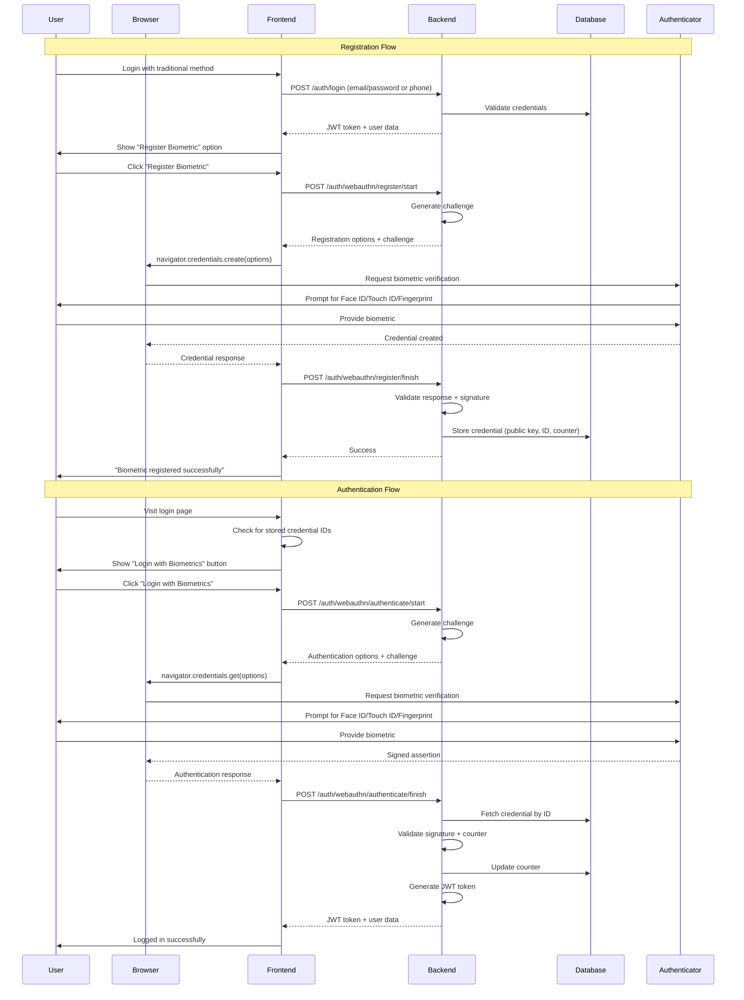
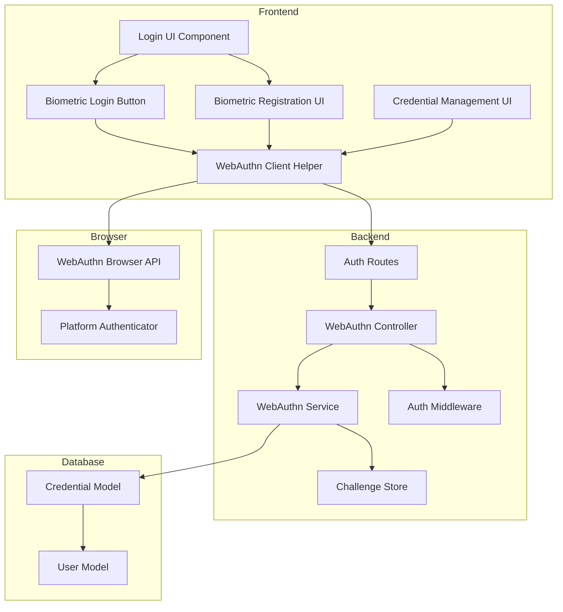

# Design Document: Biometric Authentication

## Overview

This design document describes the implementation of biometric authentication for the construction management system using the Web Authentication API (WebAuthn). The solution enables both admin users (email/password) and employee users (phone number) to register and authenticate using platform authenticators such as Face ID, Touch ID, fingerprint sensors, and Windows Hello.

### Key Design Decisions

1. **WebAuthn Standard**: Use the W3C Web Authentication API for standardized, secure biometric authentication
2. **Platform Authenticators Only**: Restrict to platform authenticators (built-in biometrics) rather than cross-platform authenticators (security keys)
3. **User Verification Required**: Always require user verification (biometric or PIN) for maximum security
4. **Challenge-Response Protocol**: Implement cryptographic challenge-response to prevent replay attacks
5. **Multi-Device Support**: Allow users to register multiple credentials for different devices
6. **Fallback Always Available**: Traditional login methods remain available at all times
7. **Server-Side Validation**: Perform all cryptographic validation on the server to prevent tampering

### Technology Stack

- **Frontend**: WebAuthn Browser API (`navigator.credentials.create()`, `navigator.credentials.get()`)
- **Backend**: Node.js with Express
- **WebAuthn Library**: `@simplewebauthn/server` for server-side validation
- **WebAuthn Client Library**: `@simplewebauthn/browser` for client-side helpers
- **Database**: MongoDB for storing credential data
- **Cryptography**: ES256 (ECDSA with P-256 and SHA-256) as primary algorithm

## Architecture

### High-Level Flow




### Component Architecture




## Components and Interfaces

### Backend Components

#### 1. Credential Model (MongoDB Schema)

```javascript
{
  userId: ObjectId,              // Reference to User or Employee
  userType: String,              // "admin" or "employee"
  credentialId: Buffer,          // Unique credential identifier (base64url decoded)
  publicKey: Buffer,             // Public key for signature verification
  counter: Number,               // Signature counter for clone detection
  transports: [String],          // ["internal"] for platform authenticators
  aaguid: Buffer,                // Authenticator AAGUID
  deviceInfo: {
    userAgent: String,           // Browser user agent
    platform: String,            // OS platform
    registeredAt: Date           // Registration timestamp
  },
  createdAt: Date,
  lastUsedAt: Date
}
```

#### 2. Challenge Store (In-Memory or Redis)

Temporary storage for challenges during registration/authentication ceremonies:

```javascript
{
  challengeId: String,           // UUID for this challenge
  challenge: String,             // Base64url encoded random bytes
  userId: String,                // User ID (for authentication)
  userType: String,              // "admin" or "employee"
  type: String,                  // "registration" or "authentication"
  createdAt: Date,               // Timestamp
  expiresAt: Date                // Challenge expiration (5 minutes)
}
```

#### 3. WebAuthn Service

Core service handling WebAuthn operations:

```javascript
class WebAuthnService {
  // Generate registration options for a user
  generateRegistrationOptions(user, userType) {
    // Returns: { challenge, rp, user, pubKeyCredParams, timeout, attestation, authenticatorSelection }
  }

  // Verify registration response
  verifyRegistrationResponse(response, expectedChallenge, expectedOrigin) {
    // Returns: { verified, credential }
  }

  // Generate authentication options
  generateAuthenticationOptions(credentials) {
    // Returns: { challenge, allowCredentials, timeout, userVerification }
  }

  // Verify authentication response
  verifyAuthenticationResponse(response, credential, expectedChallenge, expectedOrigin) {
    // Returns: { verified, newCounter }
  }

  // Get credentials for user
  getCredentialsForUser(userId, userType) {
    // Returns: Array of credentials
  }

  // Delete credential
  deleteCredential(credentialId, userId, userType) {
    // Returns: Boolean success
  }
}
```

#### 4. WebAuthn Controller

Express route handlers:

```javascript
// POST /api/auth/webauthn/register/start
async startRegistration(req, res) {
  // 1. Verify user is authenticated (JWT)
  // 2. Generate registration options
  // 3. Store challenge
  // 4. Return options to client
}

// POST /api/auth/webauthn/register/finish
async finishRegistration(req, res) {
  // 1. Verify user is authenticated (JWT)
  // 2. Retrieve challenge
  // 3. Verify registration response
  // 4. Store credential in database
  // 5. Return success
}

// POST /api/auth/webauthn/authenticate/start
async startAuthentication(req, res) {
  // 1. Receive credential IDs from client
  // 2. Generate authentication options
  // 3. Store challenge
  // 4. Return options to client
}

// POST /api/auth/webauthn/authenticate/finish
async finishAuthentication(req, res) {
  // 1. Retrieve challenge
  // 2. Fetch credential from database
  // 3. Verify authentication response
  // 4. Validate counter
  // 5. Update counter and lastUsedAt
  // 6. Generate JWT token
  // 7. Return token and user data
}

// GET /api/auth/webauthn/credentials
async listCredentials(req, res) {
  // 1. Verify user is authenticated (JWT)
  // 2. Fetch all credentials for user
  // 3. Return sanitized credential list
}

// DELETE /api/auth/webauthn/credentials/:credentialId
async deleteCredential(req, res) {
  // 1. Verify user is authenticated (JWT)
  // 2. Delete credential
  // 3. Return success
}
```

### Frontend Components

#### 1. WebAuthn Client Helper

Utility functions for WebAuthn operations:

```javascript
class WebAuthnClient {
  // Check if WebAuthn is supported
  static isSupported() {
    return window.PublicKeyCredential !== undefined;
  }

  // Check if platform authenticator is available
  static async isPlatformAuthenticatorAvailable() {
    return await PublicKeyCredential.isUserVerifyingPlatformAuthenticatorAvailable();
  }

  // Register a new credential
  static async register(options) {
    // 1. Convert options from server (base64url decode)
    // 2. Call navigator.credentials.create()
    // 3. Convert response for server (base64url encode)
    // 4. Return formatted response
  }

  // Authenticate with credential
  static async authenticate(options) {
    // 1. Convert options from server (base64url decode)
    // 2. Call navigator.credentials.get()
    // 3. Convert response for server (base64url encode)
    // 4. Return formatted response
  }

  // Store credential ID locally for quick access
  static storeCredentialId(credentialId) {
    localStorage.setItem('webauthn_credential_id', credentialId);
  }

  // Get stored credential ID
  static getStoredCredentialId() {
    return localStorage.getItem('webauthn_credential_id');
  }

  // Clear stored credential ID
  static clearStoredCredentialId() {
    localStorage.removeItem('webauthn_credential_id');
  }
}
```

#### 2. Login UI Component Updates

Modifications to existing Login component:

```javascript
function Login({ onLogin }) {
  const [loginType, setLoginType] = useState('admin');
  const [showBiometric, setShowBiometric] = useState(false);
  const [biometricAvailable, setBiometricAvailable] = useState(false);

  useEffect(() => {
    // Check if biometric is available and user has stored credential
    checkBiometricAvailability();
  }, []);

  async function checkBiometricAvailability() {
    const supported = WebAuthnClient.isSupported();
    const available = await WebAuthnClient.isPlatformAuthenticatorAvailable();
    const hasCredential = WebAuthnClient.getStoredCredentialId() !== null;
    setBiometricAvailable(supported && available && hasCredential);
  }

  async function handleBiometricLogin() {
    // 1. Call /api/auth/webauthn/authenticate/start
    // 2. Call WebAuthnClient.authenticate()
    // 3. Call /api/auth/webauthn/authenticate/finish
    // 4. Store token and call onLogin()
  }

  // Render biometric button if available
  // Keep traditional login forms
}
```

#### 3. Biometric Registration Component

Post-login registration flow:

```javascript
function BiometricRegistration({ user, onComplete, onSkip }) {
  const [registering, setRegistering] = useState(false);
  const [error, setError] = useState('');

  async function handleRegister() {
    try {
      setRegistering(true);
      
      // 1. Call /api/auth/webauthn/register/start
      const optionsResponse = await api.post('/auth/webauthn/register/start');
      const options = optionsResponse.data.data;
      
      // 2. Call WebAuthn API
      const credential = await WebAuthnClient.register(options);
      
      // 3. Call /api/auth/webauthn/register/finish
      await api.post('/auth/webauthn/register/finish', credential);
      
      // 4. Store credential ID locally
      WebAuthnClient.storeCredentialId(credential.id);
      
      onComplete();
    } catch (err) {
      setError(err.message);
    } finally {
      setRegistering(false);
    }
  }

  return (
    // UI for registration prompt
  );
}
```

#### 4. Credential Management Component

Settings page for managing credentials:

```javascript
function CredentialManagement() {
  const [credentials, setCredentials] = useState([]);
  const [loading, setLoading] = useState(true);

  useEffect(() => {
    loadCredentials();
  }, []);

  async function loadCredentials() {
    const response = await api.get('/auth/webauthn/credentials');
    setCredentials(response.data.data.credentials);
    setLoading(false);
  }

  async function handleDelete(credentialId) {
    if (confirm('Remove this biometric credential?')) {
      await api.delete(`/auth/webauthn/credentials/${credentialId}`);
      loadCredentials();
    }
  }

  async function handleAddNew() {
    // Trigger registration flow
  }

  return (
    // UI for listing and managing credentials
  );
}
```

## Data Models

### Credential Document Schema

```javascript
const credentialSchema = new mongoose.Schema({
  userId: {
    type: mongoose.Schema.Types.ObjectId,
    required: true,
    refPath: 'userType'
  },
  userType: {
    type: String,
    required: true,
    enum: ['User', 'Employee']
  },
  credentialId: {
    type: Buffer,
    required: true,
    unique: true
  },
  publicKey: {
    type: Buffer,
    required: true
  },
  counter: {
    type: Number,
    required: true,
    default: 0
  },
  transports: [{
    type: String,
    enum: ['internal', 'usb', 'nfc', 'ble']
  }],
  aaguid: {
    type: Buffer
  },
  deviceInfo: {
    userAgent: String,
    platform: String,
    registeredAt: {
      type: Date,
      default: Date.now
    }
  },
  lastUsedAt: {
    type: Date
  }
}, {
  timestamps: true
});

// Index for fast lookups
credentialSchema.index({ userId: 1, userType: 1 });
credentialSchema.index({ credentialId: 1 });
```

### User Model Updates

No schema changes required. Credentials are stored in separate collection with references.

### Challenge Store Structure

For in-memory implementation (can be moved to Redis for production):

```javascript
const challengeStore = new Map();

function storeChallenge(challengeId, data) {
  challengeStore.set(challengeId, {
    ...data,
    expiresAt: Date.now() + 5 * 60 * 1000 // 5 minutes
  });
}

function getChallenge(challengeId) {
  const data = challengeStore.get(challengeId);
  if (!data) return null;
  if (Date.now() > data.expiresAt) {
    challengeStore.delete(challengeId);
    return null;
  }
  return data;
}

function deleteChallenge(challengeId) {
  challengeStore.delete(challengeId);
}

// Cleanup expired challenges periodically
setInterval(() => {
  const now = Date.now();
  for (const [id, data] of challengeStore.entries()) {
    if (now > data.expiresAt) {
      challengeStore.delete(id);
    }
  }
}, 60000); // Every minute
```


## Correctness Properties

*A property is a characteristic or behavior that should hold true across all valid executions of a system—essentially, a formal statement about what the system should do. Properties serve as the bridge between human-readable specifications and machine-verifiable correctness guarantees.*

### Property Reflection

After analyzing all acceptance criteria, I identified the following redundancies:
- Requirements 2.2-2.5 duplicate 1.2-1.5 for employee users (same system behavior)
- Requirements 4.1-4.6 duplicate 3.1-3.6 for employee users (same system behavior)
- Requirement 6.6 is covered by specific validation properties 6.3-6.5
- Requirement 7.4 duplicates 7.2 (both about not storing biometric data)
- Requirement 12.1 duplicates 1.4 (both about multiple credentials)
- Requirement 12.3 duplicates 5.1 (both about displaying credential info)

The consolidated properties below cover both admin and employee users without duplication.

### Registration Properties

**Property 1: Challenge Generation for Registration**
*For any* registration request (admin or employee user), the system SHALL generate a cryptographically random challenge of at least 16 bytes (128 bits).
**Validates: Requirements 1.2, 2.2, 6.1**

**Property 2: Credential Storage Completeness**
*For any* successful credential registration, the system SHALL store exactly the credential ID, public key, counter, transports, aaguid, and device metadata, and SHALL NOT store any private keys or biometric data.
**Validates: Requirements 1.3, 2.3, 7.2, 7.3**

**Property 3: Multiple Credential Support**
*For any* user with N registered credentials, the system SHALL allow registration of an (N+1)th credential without removing or invalidating existing credentials.
**Validates: Requirements 1.4, 2.4, 12.1**

**Property 4: Platform Authenticator Configuration**
*For any* registration request, the system SHALL specify authenticatorAttachment as "platform" and userVerification as "required" in the registration options.
**Validates: Requirements 8.1, 8.2**

**Property 5: Device Metadata Storage**
*For any* credential registration, the system SHALL store device information including user agent, platform, and registration timestamp.
**Validates: Requirements 12.2**

**Property 6: Counter Initialization**
*For any* newly registered credential, the system SHALL initialize the signature counter to the value provided in the authenticator data.
**Validates: Requirements 13.1**

### Authentication Properties

**Property 7: Challenge Generation for Authentication**
*For any* authentication request, the system SHALL generate a cryptographically random challenge of at least 16 bytes (128 bits).
**Validates: Requirements 3.2, 4.2, 6.2**

**Property 8: Challenge Validation**
*For any* authentication response, if the challenge in the response does not match the challenge that was issued, the system SHALL reject the authentication attempt.
**Validates: Requirements 6.3**

**Property 9: Signature Validation**
*For any* authentication response, the system SHALL verify the signature using the stored public key, and SHALL reject the authentication if signature verification fails.
**Validates: Requirements 3.3, 4.3, 6.4**

**Property 10: Origin Validation**
*For any* authentication response, if the origin in the authenticator data does not match the expected application origin, the system SHALL reject the authentication attempt.
**Validates: Requirements 6.5**

**Property 11: JWT Token Issuance**
*For any* successful biometric authentication, the system SHALL issue a JWT token with the same claims and expiration as traditional login for that user type.
**Validates: Requirements 3.4, 4.4**

**Property 12: Multi-Credential Authentication**
*For any* user with multiple registered credentials, the system SHALL accept authentication using any of those credentials.
**Validates: Requirements 12.5**

**Property 13: Counter Increment Validation**
*For any* authentication response where the stored counter is greater than zero, if the new counter value is not greater than the stored counter value, the system SHALL reject the authentication attempt.
**Validates: Requirements 13.3, 13.4**

**Property 14: Counter Update**
*For any* successful authentication, the system SHALL update the stored counter value to the new counter value from the authenticator data.
**Validates: Requirements 13.5**

### Credential Management Properties

**Property 15: Credential List Completeness**
*For any* user accessing the credential management interface, the system SHALL display all registered credentials with credential ID, device information, registration date, and last used date.
**Validates: Requirements 5.1, 12.3**

**Property 16: Credential Deletion**
*For any* credential deletion request from an authenticated user, if the credential belongs to that user, the system SHALL remove the credential from the database.
**Validates: Requirements 5.3**

### API Properties

**Property 17: Error Response Format**
*For any* API endpoint receiving invalid input data, the system SHALL return an HTTP 4xx status code and a JSON response containing an error message.
**Validates: Requirements 10.7**

### Round-Trip Properties

**Property 18: Registration Options Serialization**
*For any* registration options generated by the server, encoding to JSON and decoding back SHALL produce equivalent options with the same challenge, user ID, and configuration.
**Validates: Requirements 1.2, 2.2**

**Property 19: Authentication Options Serialization**
*For any* authentication options generated by the server, encoding to JSON and decoding back SHALL produce equivalent options with the same challenge and allowed credentials.
**Validates: Requirements 3.2, 4.2**


## Error Handling

### Client-Side Error Handling

#### WebAuthn API Errors

1. **NotSupportedError**: Browser doesn't support WebAuthn
   - Display: "Your browser doesn't support biometric authentication. Please use traditional login."
   - Action: Hide biometric options, show only traditional login

2. **NotAllowedError**: User cancelled or timeout
   - Display: "Biometric authentication was cancelled. Please try again or use traditional login."
   - Action: Keep biometric button available, show traditional login

3. **InvalidStateError**: Credential already registered
   - Display: "This biometric credential is already registered."
   - Action: Skip registration, proceed to app

4. **SecurityError**: Origin mismatch or insecure context
   - Display: "Security error. Please ensure you're using HTTPS."
   - Action: Log error, show traditional login only

5. **UnknownError**: Generic authenticator error
   - Display: "Biometric authentication failed. Please try traditional login."
   - Action: Log error details, show traditional login

#### Network Errors

1. **Connection Failed**: Cannot reach server
   - Display: "Connection error. Please check your internet connection."
   - Action: Retry button, fallback to traditional login

2. **Timeout**: Request took too long
   - Display: "Request timed out. Please try again."
   - Action: Retry button, fallback to traditional login

3. **Server Error (5xx)**: Backend failure
   - Display: "Server error. Please try again later or use traditional login."
   - Action: Log error, show traditional login

### Server-Side Error Handling

#### Validation Errors

1. **Invalid Challenge**: Challenge mismatch or expired
   - HTTP 400: "Invalid or expired challenge. Please try again."
   - Action: Client should restart authentication flow

2. **Invalid Signature**: Signature verification failed
   - HTTP 401: "Authentication failed. Invalid signature."
   - Action: Log security event, reject authentication

3. **Invalid Origin**: Origin doesn't match expected value
   - HTTP 403: "Invalid origin. Authentication rejected."
   - Action: Log security event, reject authentication

4. **Counter Validation Failed**: Possible cloned authenticator
   - HTTP 403: "Security error. Credential may be compromised."
   - Action: Log security alert, reject authentication, notify user

5. **Credential Not Found**: Credential ID doesn't exist
   - HTTP 404: "Credential not found. Please register again."
   - Action: Client should offer registration

6. **User Not Found**: User ID doesn't exist
   - HTTP 404: "User not found."
   - Action: Reject authentication

#### Authorization Errors

1. **Unauthorized Credential Access**: User trying to delete another user's credential
   - HTTP 403: "Access denied. You can only manage your own credentials."
   - Action: Reject request

2. **Missing Authentication**: No JWT token provided
   - HTTP 401: "Authentication required."
   - Action: Redirect to login

3. **Expired Token**: JWT token expired
   - HTTP 401: "Session expired. Please log in again."
   - Action: Clear token, redirect to login

#### Database Errors

1. **Duplicate Credential**: Credential ID already exists
   - HTTP 409: "This credential is already registered."
   - Action: Skip registration or update existing

2. **Database Connection Failed**: Cannot connect to MongoDB
   - HTTP 503: "Service temporarily unavailable. Please try again later."
   - Action: Log error, retry with exponential backoff

3. **Database Operation Failed**: Query or update failed
   - HTTP 500: "Internal server error. Please try again."
   - Action: Log error, return generic error to client

### Error Logging

All errors should be logged with appropriate context:

```javascript
{
  timestamp: Date,
  level: "error" | "warning" | "info",
  type: "webauthn_error" | "validation_error" | "security_error" | "database_error",
  userId: String,
  userType: "admin" | "employee",
  credentialId: String (if applicable),
  errorCode: String,
  errorMessage: String,
  stackTrace: String (for server errors),
  requestId: String,
  ipAddress: String,
  userAgent: String
}
```

### Security Event Logging

Critical security events require special logging:

1. **Counter Validation Failure**: Possible cloned authenticator
2. **Origin Mismatch**: Possible phishing attempt
3. **Invalid Signature**: Possible tampering
4. **Repeated Failed Attempts**: Possible brute force

These should trigger alerts and potentially lock the credential or account.

## Testing Strategy

### Dual Testing Approach

This feature requires both unit tests and property-based tests for comprehensive coverage:

- **Unit tests**: Verify specific examples, edge cases, and error conditions
- **Property tests**: Verify universal properties across all inputs

Both approaches are complementary and necessary. Unit tests catch concrete bugs in specific scenarios, while property tests verify general correctness across a wide range of inputs.

### Property-Based Testing

**Library**: Use `fast-check` for JavaScript/TypeScript property-based testing

**Configuration**:
- Minimum 100 iterations per property test (due to randomization)
- Each test must reference its design document property
- Tag format: `// Feature: biometric-authentication, Property {number}: {property_text}`

**Property Test Examples**:

```javascript
// Feature: biometric-authentication, Property 1: Challenge Generation for Registration
test('registration challenges are at least 16 bytes', async () => {
  await fc.assert(
    fc.asyncProperty(
      fc.record({
        userId: fc.string(),
        userType: fc.constantFrom('admin', 'employee'),
        name: fc.string(),
        email: fc.emailAddress()
      }),
      async (user) => {
        const options = await webauthnService.generateRegistrationOptions(user, user.userType);
        const challengeBuffer = Buffer.from(options.challenge, 'base64url');
        expect(challengeBuffer.length).toBeGreaterThanOrEqual(16);
      }
    ),
    { numRuns: 100 }
  );
});

// Feature: biometric-authentication, Property 8: Challenge Validation
test('authentication fails with mismatched challenge', async () => {
  await fc.assert(
    fc.asyncProperty(
      fc.string({ minLength: 32 }), // valid challenge
      fc.string({ minLength: 32 }), // different challenge
      fc.record({
        credentialId: fc.string(),
        signature: fc.uint8Array({ minLength: 64, maxLength: 64 })
      }),
      async (issuedChallenge, responseChallenge, authResponse) => {
        fc.pre(issuedChallenge !== responseChallenge); // ensure they're different
        
        const result = await webauthnService.verifyAuthenticationResponse(
          { ...authResponse, challenge: responseChallenge },
          credential,
          issuedChallenge,
          expectedOrigin
        );
        
        expect(result.verified).toBe(false);
      }
    ),
    { numRuns: 100 }
  );
});

// Feature: biometric-authentication, Property 13: Counter Increment Validation
test('authentication fails when counter does not increment', async () => {
  await fc.assert(
    fc.asyncProperty(
      fc.integer({ min: 1, max: 1000 }), // stored counter
      fc.integer({ min: 0, max: 1000 }), // new counter
      async (storedCounter, newCounter) => {
        fc.pre(newCounter <= storedCounter); // ensure counter doesn't increment
        
        const credential = {
          counter: storedCounter,
          publicKey: mockPublicKey,
          credentialId: mockCredentialId
        };
        
        const authResponse = createMockAuthResponse(newCounter);
        
        const result = await webauthnService.verifyAuthenticationResponse(
          authResponse,
          credential,
          validChallenge,
          expectedOrigin
        );
        
        expect(result.verified).toBe(false);
      }
    ),
    { numRuns: 100 }
  );
});
```

### Unit Testing

**Focus Areas**:
- Specific examples of successful registration and authentication
- Edge cases (empty credentials list, last credential deletion)
- Error conditions (network failures, invalid inputs)
- Integration between components

**Unit Test Examples**:

```javascript
describe('Biometric Registration', () => {
  test('admin user sees registration prompt after first login', async () => {
    const user = await loginAsAdmin('admin@example.com', 'password');
    const hasCredentials = await hasRegisteredCredentials(user.id);
    expect(hasCredentials).toBe(false);
    // UI should show registration prompt
  });

  test('registration stores all required credential fields', async () => {
    const credential = await registerBiometricCredential(mockUser);
    expect(credential).toHaveProperty('credentialId');
    expect(credential).toHaveProperty('publicKey');
    expect(credential).toHaveProperty('counter');
    expect(credential).toHaveProperty('deviceInfo');
    expect(credential).not.toHaveProperty('privateKey');
    expect(credential).not.toHaveProperty('biometricData');
  });

  test('deleting last credential shows warning message', async () => {
    const user = await createUserWithOneCredential();
    const response = await deleteCredential(user.credentials[0].id);
    expect(response.message).toContain('traditional login');
  });
});

describe('Error Handling', () => {
  test('returns 400 for expired challenge', async () => {
    const expiredChallenge = createExpiredChallenge();
    const response = await authenticateWithChallenge(expiredChallenge);
    expect(response.status).toBe(400);
    expect(response.body.message).toContain('expired');
  });

  test('returns 401 for invalid signature', async () => {
    const invalidResponse = createAuthResponseWithInvalidSignature();
    const response = await finishAuthentication(invalidResponse);
    expect(response.status).toBe(401);
    expect(response.body.message).toContain('Invalid signature');
  });
});
```

### Integration Testing

Test end-to-end flows:

1. **Complete Registration Flow**:
   - Login with traditional method
   - Initiate registration
   - Complete registration
   - Verify credential stored
   - Verify credential appears in management UI

2. **Complete Authentication Flow**:
   - Register credential
   - Logout
   - Authenticate with biometric
   - Verify JWT token issued
   - Verify session created

3. **Multi-Device Flow**:
   - Register credential on device 1
   - Register credential on device 2
   - Authenticate from device 1
   - Authenticate from device 2
   - Verify both work independently

4. **Credential Management Flow**:
   - Register multiple credentials
   - List credentials
   - Delete one credential
   - Verify deletion
   - Verify other credentials still work

### Browser Compatibility Testing

Test on multiple platforms:
- iOS Safari (Face ID, Touch ID)
- macOS Safari (Touch ID)
- macOS Chrome (Touch ID)
- Android Chrome (Fingerprint)
- Windows Chrome (Windows Hello)
- Windows Edge (Windows Hello)

### Security Testing

1. **Replay Attack Prevention**: Verify challenges cannot be reused
2. **Origin Validation**: Verify authentication fails with wrong origin
3. **Counter Validation**: Verify cloned authenticators are detected
4. **Signature Validation**: Verify tampered responses are rejected
5. **Authorization**: Verify users can only manage their own credentials

### Performance Testing

1. **Challenge Generation**: Should complete in < 10ms
2. **Signature Verification**: Should complete in < 50ms
3. **Database Queries**: Should complete in < 100ms
4. **End-to-End Authentication**: Should complete in < 2 seconds

### Test Coverage Goals

- Line coverage: > 90%
- Branch coverage: > 85%
- Property tests: All 19 properties implemented
- Unit tests: All edge cases and error conditions covered
- Integration tests: All user flows covered

